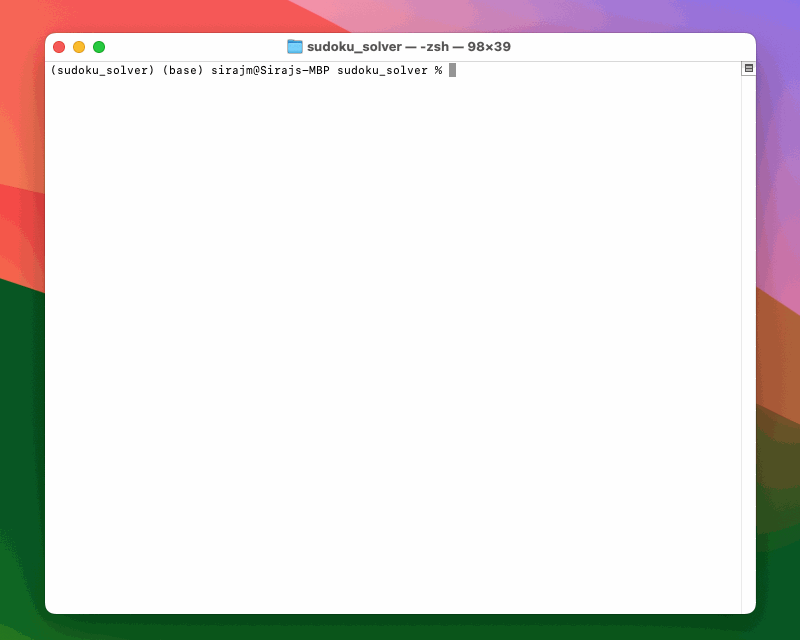

# Sudoku Solver #
- --

## Installation ##
- --
- Requires `textual` and `PuLP` packages (see `requirements.txt`)

## Features ##
- --
- Solves Hard Sudoku puzzles in less than 0.01 seconds
- Solver algorithm uses a [constraint programming](https://en.wikipedia.org/wiki/Constraint_programming) approach built with the [PuLP](https://github.com/coin-or/pulp) package
- Terminal user interface [(TUI)](https://en.wikipedia.org/wiki/Text-based_user_interface) built with the [Textual](https://github.com/Textualize/textual) package
- Test suite written with [pytest](https://github.com/pytest-dev/pytest)